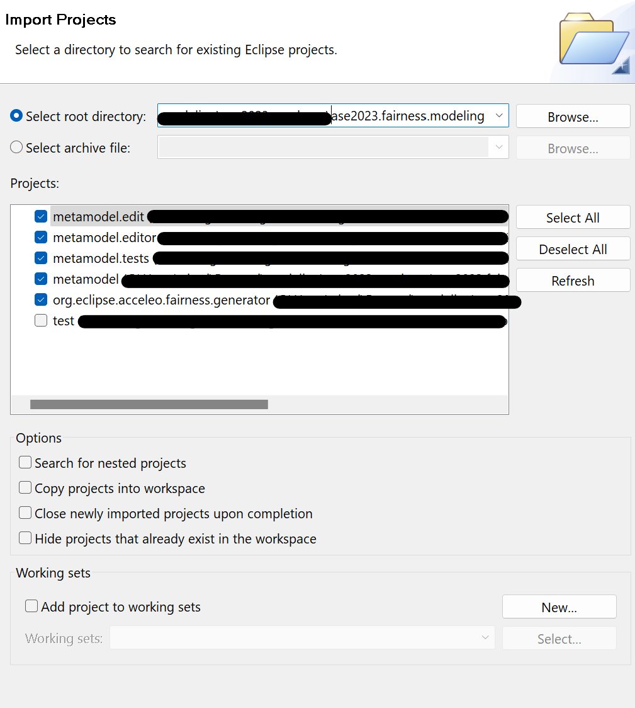
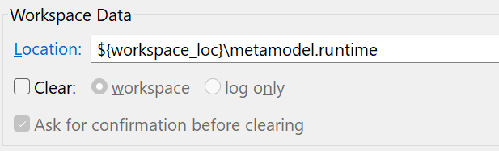
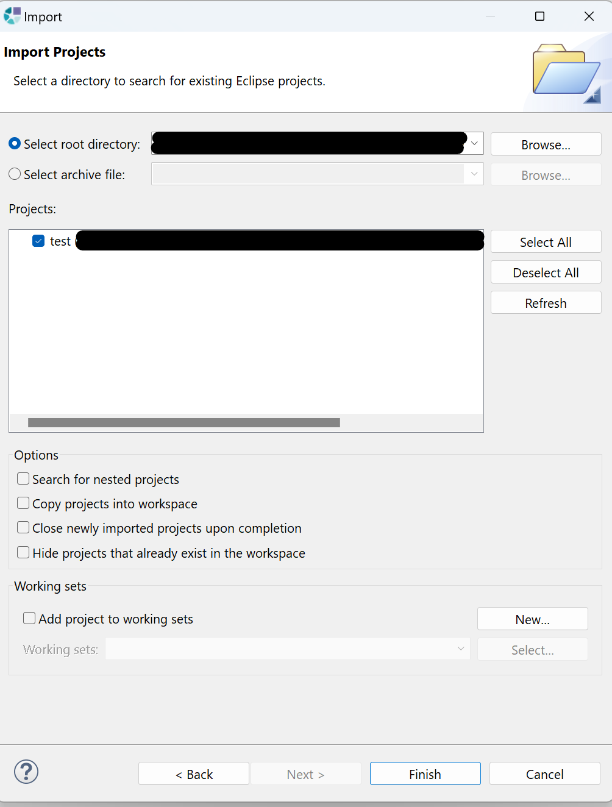

# MODNESS

This repository contains the implementation of the MODNESS framework described in the paper _How fair are we? From conceptualization to automated assessment of fairness definitions_

## Table of contents

- [MODNESS](#modness)
  - [Table of contents](#table-of-contents)
  - [Project structure](#project-structure)
  - [Evaluation reproduction](#evaluation-reproduction)
    - [How to import the models and generate the code](#how-to-import-the-metamodel-the-models-and-generate-the-code)
      - [Requirements](#requirements)
      - [Import the metamodel and models](#import-the-metamodel-and-models)
      - [Generate the code](#generate-the-code)
    - [Run the generated code](#run-the-generated-code)
      - [Requirements](#requirements-1)
      - [Run the code](#run-the-code)
  - [License](#license)

## Project structure

The project is structured as follows:

- `modness`: contains the implementation of the MODNESS framework (refer to the README.md file in the folder for more details)
- `assets`: contains pictures of the MODNESS metamodel and of the models implemented for the considered use cases
- `data`: contains the datasets used in the evaluation

## Evaluation reproduction

Follow these instructions to reproduce the evaluation performed to answer the **RQ2** of the paper

### How to import the metamodel, the models and generate the code

In the following we report the steps to import the metamodel and the models, and to generate the code.

#### Requirements

To open the EMF editor and generate the code, you have to download:

- Java version 17 ([https://adoptium.net/](https://adoptium.net/))
- Obeo Designer Community Edition 11.6.0 ([https://www.obeodesigner.com/en/download-previous-versions](https://www.obeodesigner.com/en/download-previous-versions))
- Acceleo 3.7 from the Eclipse Marketplace (inside the editor go to Help -> Eclipse Marketplace -> Type Acceleo )

#### Import the metamodel and models

1. Open Obeo Designer and select `ase2023.fairness.modeling` as workspace
2. Import the projects by clicking on _New -> Import -> Existing projects into workspace_ and select `ase2023.fairness.modeling` as _root directory_. The following projects should be listed (you can avoid to select the `test` folder):



3. After the import, you should see the projects in the sidebar
4. Right click the `metamodel` project and click _Run as...-> Run configuration_
5. In the opened window, create a new _Eclipse Application_ and specify the following _Location_:



6. Click _Run_ and wait for the new Eclipse instance to open
7. In the new Eclipse instance, click _File -> Import -> Existing projects into workspace_ and select the `metamodel.runtime` folder as _root directory_. Then, the `test` folder should be listed:



8. The implemented models should appear in the sidebar

#### Generate the code

1. Save the model with the .xmi extension
2. Run the generate.mtl file with right click -> Run as -> Launch Acceleo application by setting the following parameters:


where the **Model** is the one produced with the EMF editor and the **Target** is the folder that contains the generated code.

3. The generated code should appear in the `generated` folder

### Run the generated code

In the following we report the steps to run the generated code.

#### Requirements

- Minicoda 3 ([https://docs.conda.io/en/latest/miniconda.html](https://docs.conda.io/en/latest/miniconda.html))
- Install the following Python libraries:
  - [pandas](https://pandas.pydata.org/)
  - [IBM AIF360](https://github.com/Trusted-AI/AIF360)

#### Run the code

1. Open a terminal in the `ase2023-modeness` folder
2. Run the following command:

```bash
python ase2023.fairness.modeling/org.eclipse.acceleo.fairness.generator/generated/<PYTHON FILE>.py
```

Where `<PYTHON FILE>` is the name of one of the generated Python files (i.e., `compas.py`, `GerCredit.py`, `PopularityBias.py`)

3. The results should appear in the terminal (ignore the WARNING messages)

## License

This work is released under GPL-3.0 license
