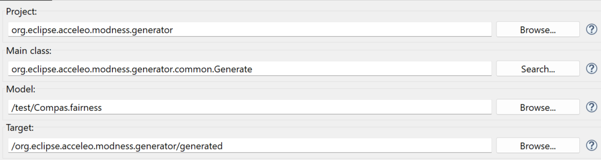

# MODNESS

This repository contains the implementation of the MODNESS framework described in the paper _How fair are we? From conceptualization to automated assessment of fairness definitions_

## Table of contents

- [MODNESS](#modness)
  - [Table of contents](#table-of-contents)
  - [Project structure](#project-structure)
  - [Evaluation reproduction](#evaluation-reproduction)
    - [1. How to import the metamodel, the models and generate the code](#1-how-to-import-the-metamodel-the-models-and-generate-the-code)
      - [1.1 Requirements](#11-requirements)
      - [1.2 Import the metamodel and models](#12-import-the-metamodel-and-models)
    - [2. Generate the code](#2-generate-the-code)
      - [2.1 Run the generated code](#21-run-the-generated-code)
        - [2.1.1 Requirements](#211-requirements)
        - [2.1.2 Run the code](#212-run-the-code)
    - [3. Run the Xtext editor](#3-run-the-xtext-editor)
  - [License](#license)

## Project structure

The project is structured as follows:

- `modness`: contains the implementation of the MODNESS framework (refer to the [README.md](./modness/README.md) file in the folder for more details)
- `assets`: contains pictures of the MODNESS metamodel and of the models implemented for the considered use cases
- `baselines`: contains the MANILA and FairML implementations of the use cases used in the evaluation
- `data`: contains the datasets used in the evaluation

## Evaluation reproduction

Follow these instructions to reproduce the evaluation performed to answer the **RQ2** of the paper

### 1. How to import the metamodel, the models and generate the code

In the following, we report the steps to import the metamodel and the models, and to generate the code.

#### 1.1 Requirements

To open the EMF editor and generate the code and the DSL, you have to download:

- **Java version 17:** [https://adoptium.net/](https://adoptium.net/)
- **Eclipse Modeling Tools 2024-03:** <https://www.eclipse.org/downloads/>
- **Acceleo 3.7** from the Eclipse Marketplace (inside the editor go to Help -> Eclipse Marketplace -> Type Acceleo)
- **Xtext 2.34.0:** follow the download and installation instructions at <https://eclipse.dev/Xtext/download.html>

#### 1.2 Import the metamodel and models

1. Open Eclipse and select `modness` as workspace
2. Import the projects by clicking on _New -> Import -> Existing projects into workspace_ and select `modness` as _root directory_. The following projects should be listed (you can avoid to select the `test` folder):


3. After the import, you should see the projects in the sidebar
4. Right-click the `metamodel` project and click _Run as...-> Run configuration_
5. In the opened window, create a new _Eclipse Application_ and specify the following _Location_:


6. Click _Run_ and wait for the new Eclipse instance to open
7. In the new Eclipse instance, click _File -> Import -> Existing projects into workspace_ and select the `metamodel.runtime` folder as _root directory_. Then, the `test` folder should be listed:


8. The implemented models should appear in the sidebar

### 2. Generate the code

1. Save the model with the .xmi extension
2. Run the generate.mtl file with right click -> Run as -> Launch Acceleo application by setting the following parameters:



where the **Model** is the one produced with the EMF editor and the **Target** is the folder that contains the generated code.


3. The generated code should appear in the `generated` folder


**Troubleshooting:** It might be necessary to programmatically register the metamodel and link the metamodel project with the Acceleo one (please note that we already added the needed lines of code in the repository). 

 1. Right-click on the Acceleo project and select _Build path -> Configure Build Path..._, then add the modeling project to the Classpath;
 2. Modify the method public void   ```registerResourceFactories(ResourceSet resourceSet)``` in the ```Generate.java``` file by adding: 
   
``` 
resourceSet.getResourceFactoryRegistry().getExtensionToFactoryMap().put(FairnessPackage.eINSTANCE.getNsURI(), FairnessPackage.eINSTANCE); 
```
In addition, you need to modify the method's annotation from @generated to @generated NOT. 

#### 2.1 Run the generated code

In the following, we report the steps to run the generated code.


##### 2.1.1 Requirements

- Minicoda 3 ([https://docs.conda.io/en/latest/miniconda.html](https://docs.conda.io/en/latest/miniconda.html))
- Install the following Python libraries:
  - [pandas](https://pandas.pydata.org/)
  - [IBM AIF360](https://github.com/Trusted-AI/AIF360)

##### 2.1.2 Run the code

1. Open a terminal in the `ase2023-modeness` folder
2. Run the following command:

```bash
python modness/org.eclipse.acceleo.fairness.generator/generated/<PYTHON_FILE>.py
```

Where `<PYTHON FILE>` is the name of one of the generated Python files (i.e., `compas.py`, `GerCredit.py`, `PopularityBias.py`)

3. The results should appear in the terminal (ignore the WARNING messages)

### 3. Run the Xtext editor

1. From the `modness` project, right click on the `org.example.xtext.modness` folder and select _Run as -> New Configuration_ and set the `metamodel.runtime` as workspace like done in points 4 and 5 of Section 1.2. Then, click _Run_ and wait for the new Eclipse instance to open:


2. In the new Eclipse instance, the `test` folder should appear in the sidebar. If not, click on _File -> Import -> Existing projects into workspace_ and select the `metamodel.runtime` folder as _root directory_. Then, the `test` folder should be listed:


3. Right click on the `test` folder and select _New -> File_ and create a new file with the `.modness` extension. The editor should open and you can start writing the code. By clicking on Ctrl + Space (Cmd + Space on Mac) you can see the available keywords.

4. The `test` contains all the use cases described in the paper, which can be used as a reference to write new models:


## License

This work is released under GPL-3.0 license
