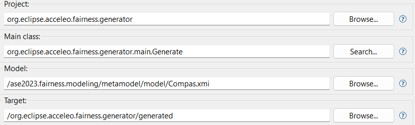

## Structure
This folder contains all the materials to reproduce the experiments presented in the paper.

The project is structured as follows:

- `metamodel`: This folder contains the EMF project with the modeling artifacts needed to generate the editor
- `metamodel.edit`: this project is automatically generated from the metamodel and contains the plugin utilities 
- `metamodel.editor`: it contains the graphical utilities for the generated model editor
- `metamodel.tests`: it contains test classes for the generated editor
- `org.eclipse.acceleo.fairness.generator`: this project contains the Acceleo template used to generate the fairness assessment code
- `test`: this folder contains the produced models using the editor.  

### Requirements
To open the EMF editor and generate the code, you have to download: 
- Java version 17 ([https://adoptium.net/](https://adoptium.net/))
- Obeo Designer Community Edition 11.6.0 ([https://www.obeodesigner.com/en/download-previous-versions](https://www.obeodesigner.com/en/download-previous-versions))
- Acceleo 3.7 from the Eclipse Marketplace (inside the editor go to Help -> Eclipse Marketplace -> Type Acceleo )

To run the generated code:
- Minicoda
- TODO

## How to replicate the experiment

Please follow these steps to reproduce the **RQ2** evaluation described in the paper, you have to:

1. Import the project by using **Open projects from the file system**
2. Run -> Run as...-> Eclipse Application
In the new instance, TODO
3. Save the model with the .xmi extension
4. Run the generate.mtl file with right click -> Run as -> Launch Acceleo application by setting the following parameters:

where the **Model** is the one produced with the EMF editor and the **Target** is the folder that contains the generated code.

## License

This work is released under GPL-3.0 license
